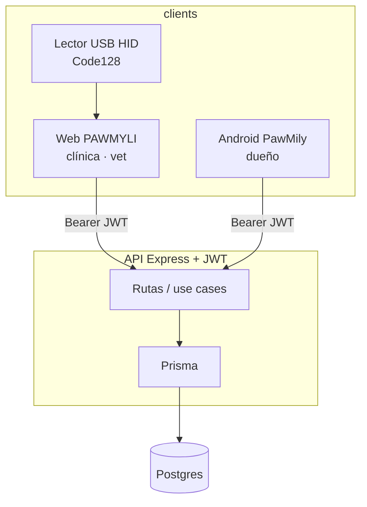
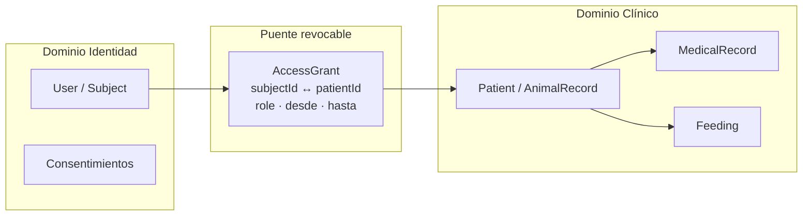

# Auditoría integral — PawMily (plataforma veterinaria híbrida)

**Fecha:** 2026-08-11  
**Rol del documento:** Arquitectura de software · Ciberseguridad · UX  
**Alcance:** Web (veterinarios) · App Android (dueños) · API Express/Prisma · Postgres (Supabase) · Lector HID (Motorola LS1203 / Code128)  
**Estado del sistema auditado:** MVP + implementación Plan Maestro (ver `FASE0_CHECKLIST_MASTER.md`, `ENV_MASTER_PLAN.md`, `BACKUP_3_2_1_1_0.md`)

---

## 1. Resumen ejecutivo

PawMily es un MVP **viable comercialmente** para clínicas pequeñas/medianas: el flujo *registro vet → código PAW → vínculo dueño* es claro, el control de roles en servidor (vet escribe clínica/dieta; owner lee) es correcto, y el hardware HID acelera el mostrador.

La estructura **aún no es 100% profesional** para escala, cumplimiento (RGPD/LFPDPPP) ni multi-cuidador. Los tres riesgos estructurales más graves hoy son:

1. **Fotos e identificadores clínicos como cadenas en Postgres** (data URL / PII mezclada con ficha clínica).  
2. **Un solo `ownerUserId` por mascota** — la UI de “familia/cuidadores” es decorativa, no un modelo de roles.  
3. **Ausencia de auditoría inmutable, borrado diferenciado (derecho al olvido vs retención clínica) y cifrado de secretos en cliente**.

La recomendación: **congelar features nuevas de negocio** hasta cerrar un “paquete de gobernanza de datos” (modelo de sujetos, almacenamiento de imágenes, logs de acceso, retención). Luego sí invertir en UI y 3-2-1.

---

## 2. Arquitectura actual (hechos)

| Capa | Tecnología | Observación |
|------|------------|-------------|
| Web | HTML/CSS/JS estático | Token en `localStorage` |
| App | Kotlin + Retrofit | Token en SharedPreferences (no cifrado) |
| API | Express + Clean/DDD ligero | Roles `vet` \| `owner` |
| DB | Postgres vía Prisma | Sin cifrado de campo; fotos en columnas `String` |
| Vínculo | `POST /patients/link` + código `PAW-######` | Primer claimer = dueño primario |

---

## 3. Auditoría de lógica y flujo

### 3.1 Cadena mascota ↔ veterinario ↔ dueño ↔ “cuidador”

| Relación | Estado real | Solidez |
|----------|-------------|---------|
| Vet → Patient | `vetId` obligatorio | Fuerte |
| Owner → Patient | `ownerUserId` único | Media (sin multi-cuidador) |
| Código → claim | Exact match + 409 si ya vinculado | Aceptable para MVP |
| Familia / cuidador | Solo muestra nombre/email del dueño | **Débil / falso positivo de producto** |
| Historial clínico | Vet escribe; owner lee | Correcto |
| Dieta | Vet escribe; owner solo lectura en app | Correcto (registro de comidas del usuario aún no es dominio formal) |

**Cuellos de botella del flujo de vinculación**

1. **Código como único secreto de posesión.** Quien tenga el sticker/papel o una foto del Code128 puede reclamar una mascota no vinculada. No hay segundo factor (PIN de clínica, OTP al teléfono del dueño declarado, ventana temporal, o “claim approval” del vet).  
2. **Denormalización de contacto.** Al vincular se sobrescriben `ownerName/Phone/Email` con el usuario que escanea; el contacto capturado por el vet puede perderse o divergir.  
3. **Escaneo manual vs hardware**  
   - *Hardware HID:* óptimo en recepción si hay foco en campo dedicado; sensible a delays del wedge (LS1203) y a foco perdido.  
   - *Manual / cámara (app):* más lento pero portable; ZXing + input HID en app cubren dos canales.  
   - *Cuello de botella UX:* el vet genera el código en web; el dueño debe tener la app instalada y cuenta `owner` **antes** de escanear. No hay “deep link / magic link” post-escaneo ni onboarding guiado en mostrador.  
4. **Sin cola de “pendiente de vinculación”.** Si el dueño falla el claim, el vet no ve un estado operativo claro (“entregado / no vinculado / vinculado a X”).

### 3.2 Recomendaciones de flujo (sin implementar aún)

| Prioridad | Mejora |
|-----------|--------|
| P0 | Modelo `PatientAccess` (owner | caregiver | viewer) con invitaciones y revocación |
| P0 | Claim con **código + PIN corto** impreso junto al barcode, o aprobación del vet |
| P1 | Estado de vinculación en ficha web (badge + fecha + usuario) |
| P1 | Deep link `pawmily://link?code=PAW-…` / Universal Link |
| P2 | Reimpresión de barcode y rotación de código (invalidar el anterior) |

---

## 4. Evaluación de seguridad y protección de datos (RGPD / LFPDPPP)

### 4.1 Clasificación de datos (hoy mezclados)

| Categoría | Ejemplos en PawMily | Tratamiento actual |
|-----------|---------------------|--------------------|
| **PII del humano** | email, teléfono, nombre, foto de perfil, licencia | En `User` y denormalizado en `Patient` |
| **Datos de la mascota** | nombre, especie, raza, microchip, foto | En `Patient` |
| **Datos clínicos / sanitarios de animal** | diagnóstico, tratamiento, prescripciones, notas, dieta | En `MedicalRecord` / `Feeding` |
| **Operativos** | citas, recordatorios, códigos | Appointment / Reminder |

En muchas jurisdicciones los datos veterinarios no son “datos de salud humana”, pero **sí están vinculados a una persona identificable** (dueño). La LFPDPPP (México) y el RGPD exigen bases legales, minimización, seguridad y derechos ARCO/olvido sobre la **persona**. El historial del animal puede tener interés legítimo de la clínica (continuidad asistencial, responsabilidad profesional).

### 4.2 Separación PII ↔ ficha clínica (“derecho al olvido” sin perder historia)

**Patrón recomendado (soberanía + retención clínica):**

**Reglas propuestas**

1. **Anonimizar / seudonimizar al ejercer olvido del sujeto humano:**  
   - Borrar o seudonimizar `User` (email→hash, teléfono→null, nombre→“Sujeto eliminado”).  
   - Revocar todos los `AccessGrant`.  
   - En `Patient`, limpiar campos de contacto humano; conservar `patientId`, historial, dieta, microchip, foto del animal (si no identifica al humano).  
2. **No borrar `MedicalRecord` por defecto** si la clínica tiene obligación/interés legítimo documentado; marcar `retentionLock=true` y base legal.  
3. **Fotos del dueño ≠ fotos de la mascota:** buckets/keys distintos; TTL y políticas de borrado independientes.  
4. **Consentimiento explícito** al vincular: “comparto mis datos de contacto con la clínica X para seguimiento”.  
5. **Exportación / portabilidad** del expediente del animal a petición (PDF/JSON), separada de la exportación de PII del humano.

### 4.3 Controles técnicos alineados a estándares reales

| Control | Estándar / práctica | Estado PawMily | Brecha |
|---------|---------------------|----------------|--------|
| TLS en tránsito | TLS 1.2+ (ideal 1.3) | HTTPS en API Railway | Verificar cipher suite / HSTS en edge |
| Cifrado en reposo | AES-256 (disco / KMS) | Depende del proveedor DB | Confirmar cifrado de volumen Supabase + backups |
| Secretos | Rotación, no en código | JWT env; fallback dev inseguro | Eliminar fallback en builds |
| AuthN/AuthZ | OAuth2/OIDC o JWT corto + refresh | JWT 24h en localStorage | Refresh tokens + HttpOnly cookies (web) |
| Minimización | Art. 5 RGPD / LFPDPPP | Payload lleva foto completa | Object storage + URLs firmadas |
| Registro de accesos | Trazabilidad | Sin audit log | Tabla `AccessAudit` append-only |
| Rate limit / Helmet | OWASP ASVS | Presente | Mantener y revisar CORS estricto |
| Claim por código | Seguridad de posesión | Débil | PIN / aprobación |

**Amenazas concretas**

- XSS en web → robo de JWT en `localStorage`.  
- Backup de teléfono → tokens en SharedPreferences.  
- Extracción de dump DB → historial clínico + fotos en claro.  
- Código de barras físico = “contraseña” de vinculación.

---

## 5. Propuesta de optimización UI (sin cambiar paleta ni layout general)

Principio: **misma jerarquía visual, mejor densidad, feedback y affordances**.

### 5.1 Formularios y contenedores

| Área | Problema actual | Mejora sugerida |
|------|-----------------|-----------------|
| Formularios largos (paciente, consulta, dieta) | Muchas filas; scroll de modal improvisado | Agrupar en secciones colapsables (“Identidad”, “Dueño”, “Clínica”) con `fieldset` visual y sticky footer Guardar/Cancelar |
| Labels | Inconsistentes en peso | Label 600 + hint 13px debajo; asterisco solo en requeridos |
| Errores | `alert()` | Inline bajo el campo + resumen arriba del form |
| Contenedores / cards | Bordes y padding variables | Tokenizar: radio 12–16px, padding 16/24, gap 12; una sombra estándar |
| Estados vacíos | Texto plano | Empty state con icono + CTA único (ya parcial en app) |
| Modales | Overlay OK; contenido denso | Progress “Paso 1/2” solo cuando aporte; no rediseñar colores |

### 5.2 Botón “adjuntar archivo” (web)

Hoy: `<input type="file">` nativo, poco alineado al sistema.

Sugerencias estéticas (misma paleta teal/coral):

1. **Dropzone** con borde dashed `#2c5f5a`, icono cámara/archivo, texto “Arrastra o elige foto (máx. 1.5 MB)”.  
2. **Preview** circular/cuadrado 96px con botón “Cambiar” superpuesto.  
3. Estados: vacío / cargando (spinner) / listo (check) / error (tamaño/tipo).  
4. Aceptar solo `image/jpeg,image/png,image/webp`; rechazar PDF/HEIC sin mensaje críptico.  
5. No mostrar la ruta del sistema del archivo; solo nombre truncado.

### 5.3 Sincronización visual Web ↔ App

| Elemento | Alinear |
|----------|---------|
| Tipografía | Web Segoe/UI vs app Material: definir escalas H1/H2/body compartidas en guía (no nuevos colores) |
| Cards de mascota | Misma estructura: foto · nombre · código · 2 metadatos |
| Código de barras | Web JsBarcode / App ZXing: mismo formato Code128 + mismo `PAW-######` visible debajo |
| Empty states | Misma copy (“Aún no hay…”) |
| Prioridad recordatorios | Misma semántica baja/media/alta (chip o borde, no nuevos colores) |
| Navegación | Web: Inicio/Pacientes/Agenda/Config · App: Home/Pets/Reminders/Profile — documentar equivalencias en onboarding |

---

## 6. Resiliencia de datos (3-2-1-1-0, TLS 1.3, AES-256)

### 6.1 Viabilidad 3-2-1-1-0 para imágenes diagnósticas

| Elemento | Significado | Viabilidad en PawMily |
|----------|-------------|------------------------|
| **3** copias | Prod + backup + réplica | Alta si se sale de “foto en fila SQL” |
| **2** medios | Disco objeto + cinta/otro cloud o NAS clínica | Media–alta |
| **1** offsite | Región distinta / cuenta distinta | Alta (S3/R2/Supabase Storage + snapshot offsite) |
| **1** offline/air-gapped | Export periódico cifrado a disco clínico | Media (proceso operativo, no solo cloud) |
| **0** errores | Restore test trimestral | Obligatoria; hoy **no verificada** |

**Conclusión:** la regla 3-2-1-1-0 **sí es viable**, pero **imposible de cumplir bien** mientras las imágenes vivan como data URL en Postgres (backups de DB se vuelven enormes, lentos y caros; restore mezcla PII+clínica).

**Arquitectura objetivo de medios**

1. Subida → API genera URL firmada → cliente sube a Object Storage.  
2. Metadatos en DB: `assetId`, `sha256`, `mime`, `patientId`, `visibility`, `retentionClass`.  
3. Backup: versionado del bucket + snapshot DB (sin blobs) + copia offsite + un export offline cifrado AES-256-GCM trimestral.  
4. Prueba de restore documentada (checklist “0 errores”).

### 6.2 TLS 1.3 y AES-256 en el intercambio web↔móvil

| Capa | Recomendación | Notas |
|------|---------------|-------|
| Tránsito | TLS 1.3 en edge (Railway/CDN/Vercel) | Ambos clientes ya usan HTTPS; auditar que no quede TLS 1.0/1.1 |
| En reposo (almacenamiento) | AES-256 (SSE-S3 / CMEK) | Proveedor cloud |
| En reposo (campos ultra sensibles) | AES-256-GCM app-level opcional | Solo si hay requisito legal; complica búsquedas |
| App en dispositivo | EncryptedSharedPreferences / Keystore | Tokens y caché de fotos |
| Integridad | HTTPS + hashes de archivo | Evita manipulación de adjuntos |

**No confundir:** “AES-256 entre web y móvil” **no** significa un protocolo propietario encima de HTTPS. El estándar correcto es **TLS 1.3 para el canal** + **cifrado en reposo AES-256** + **secretos de aplicación rotados**. Un túnel AES casero suele empeorar la seguridad.

---

## 7. Opinión crítica comercial y faltantes

### 7.1 ¿Es buena la idea?

**Sí, con nicho claro:** clínicas que ya usan códigos en mostrador + dueños que quieren recordatorios y acceso al historial. El hardware HID es un diferenciador tangible frente a “otra app de mascotas”.

**Riesgos de mercado**

- Competir con fichas clínicas veteranas (ezyVet, DigiVet, etc.) sin facturación, inventario, laboratorio o multi-sede.  
- Prometer “familia/cuidadores” sin modelo real genera desconfianza.  
- Dependencia de un código físico como único onboarding.

**Posicionamiento recomendado (fase actual):**  
“Sistema ligero de vínculo clínica–dueño con expediente compartido y recordatorios”, no “HIS veterinario completo”.

### 7.2 Faltantes para estructura 100% profesional

| Dominio | Faltante crítico |
|---------|------------------|
| Identidad | Refresh tokens, bloqueo de cuenta, verificación email/teléfono |
| Autorización | RBAC fino (vet admin / vet staff / owner / caregiver) |
| Datos | Object storage; separación PII/clínica; retención documentada |
| Auditoría | Log de quién vio/editó qué (append-only, no editable) |
| Observabilidad | Logs estructurados, métricas, tracing, alertas 5xx |
| Calidad | Tests e2e del flujo link; contract tests API |
| Legal | Aviso de privacidad, DPA con proveedores, bases legales por tratamiento |
| Ops | Runbooks, backups probados, RPO/RTO definidos |
| Producto | Multi-clínica, export expediente, rotación de códigos |
| App | Encrypted prefs, ProGuard, política de retención local |
| Web | CSP, cookies HttpOnly, sanitización XSS |

---

## 8. Matriz de puntos críticos (prioridad)

| ID | Hallazgo | Severidad | Impacto |
|----|----------|-----------|---------|
| C1 | Un cuidador/familia no modelado | Alta (producto/legal) | Features falsas |
| C2 | Fotos en DB como data URL | Alta | Coste, privacidad, 3-2-1 |
| C3 | Claim solo por código | Alta | Secuestro de mascota digital |
| C4 | Sin audit trail | Alta | Cumplimiento / disputas |
| C5 | JWT largo en storage inseguro | Media–Alta | Robo de sesión |
| C6 | PII denormalizada en Patient | Media | Derecho al olvido difícil |
| C7 | Soft-delete citas sin política global | Media | Inconsistencia de retención |
| C8 | Debug ingest / secret fallback | Media | Higiene de despliegue |

---

## 9. Lista de datos / decisiones que aún debes definir

Antes de estructurar bien el proyecto, necesitas **cerrar** estas definiciones (producto + legal + ops):

### Identidad y roles
1. ¿Quiénes existen además de vet y owner? (staff, caregiver, viewer, admin clínica)  
2. ¿Un dueño puede tener N mascotas y una mascota N cuidadores?  
3. ¿El vet puede transferir mascota a otra clínica?  
4. Política de desvinculación y revinculación  

### Código y hardware
5. ¿El código es permanente o rotatorio?  
6. ¿PIN / aprobación vet / OTP al vincular?  
7. ¿Un código sirve solo una vez o es reimprimible?  
8. Política si el lector falla (fallback UX obligatorio)

### Privacidad y retención
9. Base legal por tratamiento (contrato clínica, consentimiento dueño, interés legítimo)  
10. Plazo de retención del historial clínico tras olvido del sujeto  
11. Qué se anonimiza vs qué se borra  
12. País/región de soberanía de datos (¿solo México? ¿UE?)  
13. Encargados de tratamiento (Railway, Supabase, Vercel) y DPAs  

### Medios e imágenes
14. Tipos de adjunto (perfil, diagnóstico, radiografía, lab)  
15. Tamaño máximo, formatos, virus scan  
16. RPO/RTO y frecuencia de restore test  
17. ¿Quién paga el storage (clínica vs SaaS)?  

### Seguridad técnica
18. Tiempo de vida de access/refresh token  
19. ¿SSO clínico futuro?  
20. Política de cifrado en dispositivo móvil  
21. Requisitos TLS (¿forzar 1.3?) y HSTS  

### Producto clínico
22. ¿El dueño registra tomas de comida / medicación o solo lee?  
23. ¿Recordatorios “familiares” son compartidos o por usuario?  
24. Notificaciones: solo locales o también push (FCM)  
25. Idioma legal de consentimientos  

### Operación y negocio
26. Modelo comercial (por clínica / por vet / freemium)  
27. SLA y soporte  
28. Entorno staging vs producción y quién despliega  
29. Inventario de secretos y rotación  
30. Criterios de “listo para clínica piloto” (checklist de aceptación)

---

## 10. Roadmap recomendado (orden, sin código en este entregable)

**Fase A — Gobernanza (2–4 semanas conceptuales)**  
Definir roles, retención, consentimientos, modelo AccessGrant, política de claim.

**Fase B — Datos y seguridad base**  
Object storage + URLs firmadas; audit log; tokens cortos; EncryptedSharedPreferences; quitar secret fallback.

**Fase C — Producto verdadero multi-cuidador**  
Invitaciones, permisos, UI familia real, estados de vinculación en web.

**Fase D — Resiliencia**  
Backups 3-2-1-1-0 con restore test; monitoreo; runbooks.

**Fase E — Pulido UX**  
Dropzone de archivos, formularios seccionados, paridad visual web/app (sin retocar la paleta).

---

## 11. Conclusión

PawMily tiene un **núcleo de producto correcto** (vet escribe, dueño lee, código une mundos, hardware acelera). Para pasar de MVP a plataforma profesional debe dejar de tratar el código de barras como única confianza, **separar identidad humana de expediente animal**, sacar las imágenes del motor SQL, y añadir **auditoría + retención + backups verificados**.

La idea es comercialmente defendible si se posiciona como puente clínica–dueño con cumplimiento básico, no como HIS completo. Los 30 puntos de la sección 9 son el “brief pendiente” que debes definir antes de la siguiente oleada de código.

---

*Documento de auditoría — sin modificaciones de código asociadas.*  
*Fuentes: inspección de `pawmily-backend`, `PAWMYLI`, `PawMily` Android y comportamiento observado en producción.*
