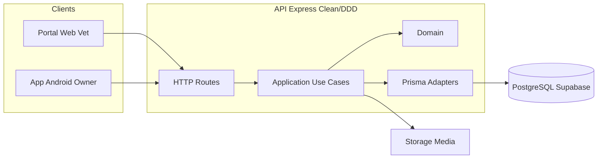
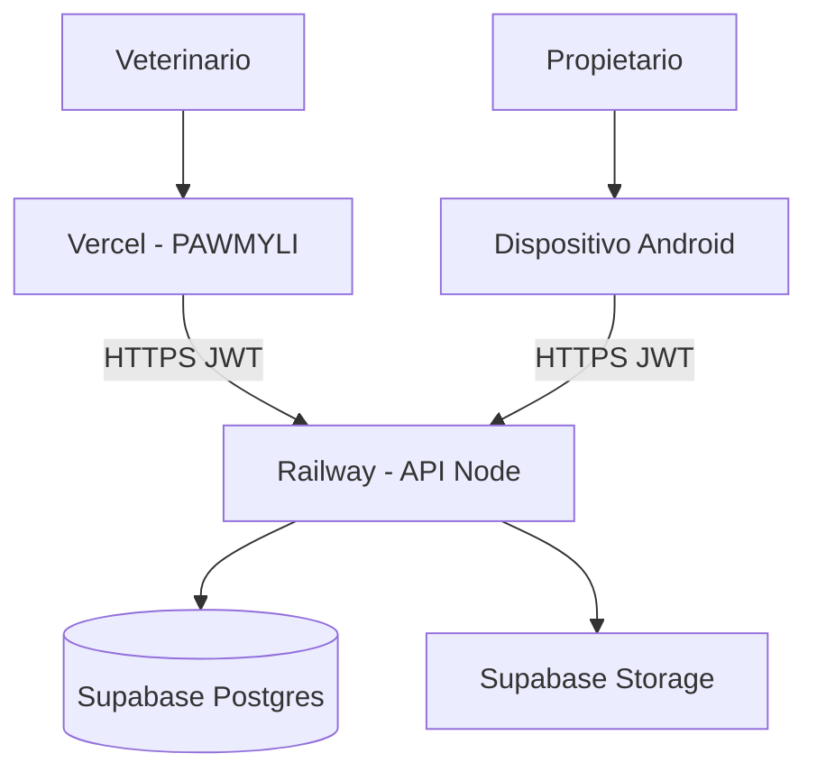
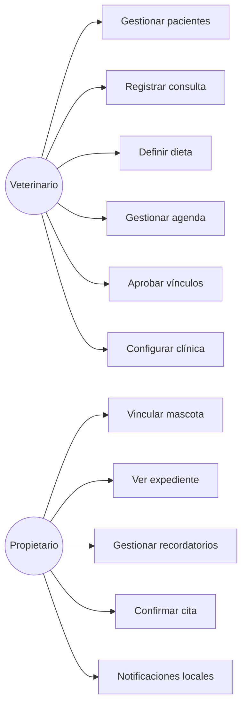
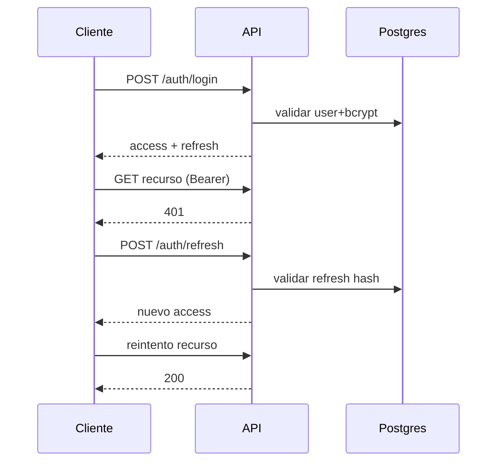
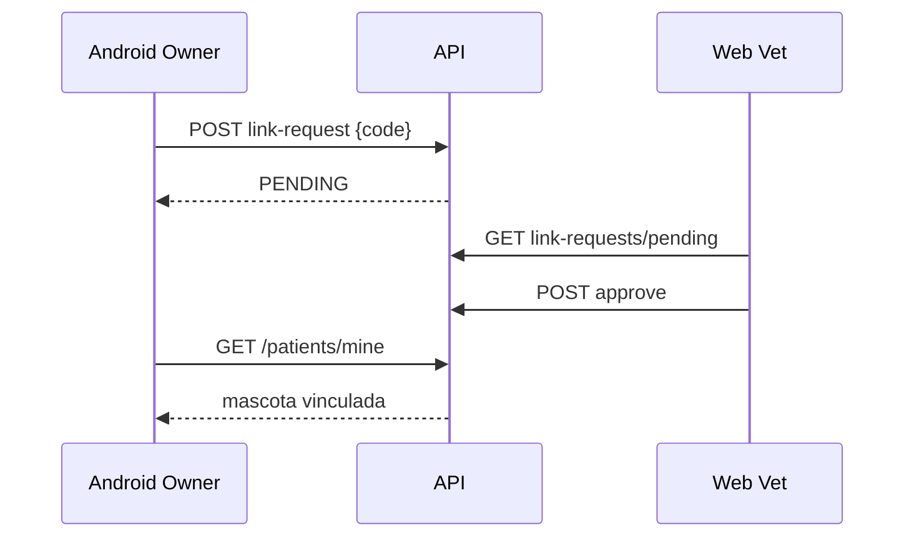

# Diagramas UML — PawMily

Los diagramas fuente están en Mermaid (abajo) y como SVG en esta carpeta.

## 1. Componentes (`Componentes.svg`)

## 2. Despliegue (`Despliegue.svg`)

## 3. Casos de uso (`Casos_de_Uso.svg`)

## 4. Secuencias críticas

### 4.1 Login + refresh (`Secuencia_Procesos_Criticos.svg` — flujo A)

### 4.2 Vinculación por código (flujo B)

