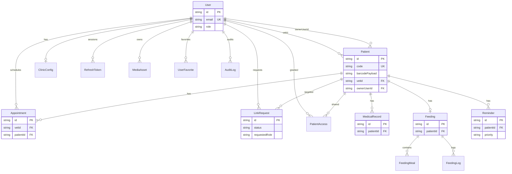

# Diagrama Entidad-Relación — PawMily

Ver también `Diagrama_Entidad_Relacion.svg`.

## Notas de diseño
- `code` es el identificador de negocio visible.  
- `ownerUserId` refleja vínculo owner aprobado.  
- `PatientAccess` permite roles adicionales sin duplicar pacientes.  
- Refresh tokens se almacenan hasheados.
