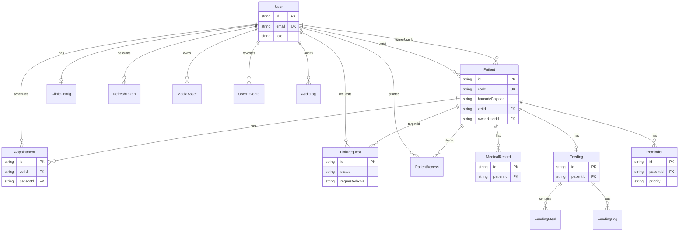

# Diagramas y modelo de datos — PawMily

Esta carpeta concentra el **modelo de datos** del sistema (DER, diccionario y scripts).  
Fuente de verdad del esquema: `prisma/schema.prisma` del backend.

## Archivos de la carpeta

| Archivo | Descripción |
|---------|-------------|
| `Diagrama_Entidad_Relacion.png` / `.svg` | Vista gráfica del DER |
| `Diagrama_Entidad_Relacion.md` | DER en Mermaid + notas de diseño |
| `Diccionario_de_Datos.md` / `.pdf` | Campos, tipos y significado por entidad |
| `Scripts_BD_DDL_Seeds.sql` | Referencia DDL/seeds (usar Prisma en entornos reales) |

---

## 1. Diagrama Entidad-Relación (`Diagrama_Entidad_Relacion.svg` / `.png`)



### Lectura rápida de relaciones
- **User → Patient (`vetId`)**: el veterinario es dueño clínico de la ficha.  
- **User → Patient (`ownerUserId`)**: propietario vinculado (tras aprobar `LinkRequest`).  
- **Patient → MedicalRecord / Feeding / Reminder / Appointment**: expediente clínico y operativo.  
- **PatientAccess / LinkRequest**: control de accesos y solicitudes de vínculo.  
- **RefreshToken / MediaAsset / AuditLog**: sesión, media y auditoría.

---

## 2. Diccionario de datos

Ver `Diccionario_de_Datos.md` (y PDF homónimo) para el detalle de columnas de:

`User`, `Patient`, `PatientAccess`, `LinkRequest`, `MedicalRecord`, `Feeding`, `Reminder`, `Appointment`, `ClinicConfig`, tokens de seguridad, `MediaAsset`, `UserFavorite`, `AuditLog`.

---

## 3. Scripts DDL / seeds

`Scripts_BD_DDL_Seeds.sql` documenta semillas de prueba y notas de índices.  
En desarrollo/producción preferir:

```bash
npx prisma db push
# o
npx prisma migrate dev
```

Semilla recomendada vía API: register vet → register owner → create patient → link-request → approve.

---

## 4. Notas de diseño clave
- `Patient.code` (`PAW-…`) es el identificador de negocio visible (barcode Code128).  
- `ownerUserId` solo se completa con vínculo aprobado.  
- Refresh tokens se guardan **hasheados**.  
- Listados lean pueden omitir cargas pesadas (p. ej. fotos embebidas grandes), pero el modelo las contempla.
